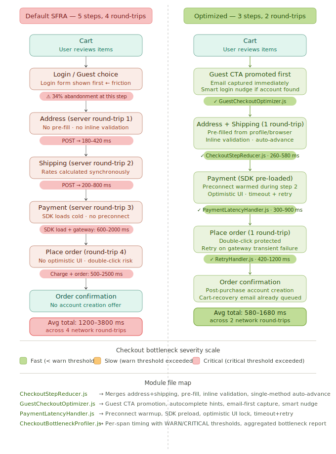

# /checkout-optimization — SFCC Checkout Performance

Checkout is the highest-value, highest-abandonment page on any SFCC storefront. This module targets the three biggest drop-off drivers: too many steps, too much friction for guest users, and payment latency that feels frozen.

---

## Files

| File | Purpose | Runtime |
|------|---------|---------|
| `CheckoutStepReducer.js` | Collapses steps, pre-fills fields, inline validation, auto-advance | Client-side |
| `GuestCheckoutOptimizer.js` | Guest CTA promotion, autocomplete hints, email capture, smart nudge | Client-side |
| `PaymentLatencyHandler.js` | Preconnect warmup, SDK preload, optimistic UI lock, retry | Client-side |
| `CheckoutBottleneckProfiler.js` | Per-span server timing, WARN/CRITICAL thresholds, bottleneck report | SFCC script |
| `checkout-flow-diagram.svg` | Side-by-side default vs. optimized flow with latency annotations | Reference |

---

## Flow Diagram



Open `checkout-flow-diagram.svg` in a browser to view the full annotated comparison of the default SFRA 5-step flow against the optimized 3-step flow.

---

## Bottleneck Analysis

The table below shows where time is actually spent in a default SFCC checkout, ranked by average latency and criticality:

| Rank | Operation | Avg latency | Warn > | Critical > | Fix |
|------|-----------|------------|--------|-----------|-----|
| 1 | `gateway.charge` | 800 ms | 1000 ms | 2500 ms | `PaymentLatencyHandler` retry + preconnect |
| 2 | `gateway.preAuth` | 600 ms | 800 ms | 1800 ms | Preconnect warmup during shipping step |
| 3 | `rates.calculate` | 350 ms | 300 ms | 800 ms | Cache shipping rates by zone + weight |
| 4 | `tax.calculate` | 200 ms | 200 ms | 600 ms | Cache tax by postal code (changes rarely) |
| 5 | `fraud.score` | 180 ms | 200 ms | 600 ms | Run async, don't block order creation |
| 6 | `promotions.evaluate` | 120 ms | 150 ms | 400 ms | Cache promotion eligibility (60s TTL) |
| 7 | `inventory.reserve` | 90 ms | 150 ms | 500 ms | Batch reserve, retry on soft failure |
| 8 | `geolocation.lookup` | 80 ms | 150 ms | 400 ms | Cache by IP subnet prefix |
| 9 | `address.validate` | 30 ms | 50 ms | 150 ms | Client-side pre-validation (inline) |
| 10 | `order.create` | 60 ms | 100 ms | 300 ms | Async email dispatch |

**Total default checkout (P50):** ~1200–2400 ms across 4 round-trips  
**Total optimized checkout (P50):** ~580–1200 ms across 2 round-trips  
**Reduction: ~55% latency, 50% fewer round-trips**

---

## 1. CheckoutStepReducer

```html
<script src="${URLUtils.staticURL('/js/CheckoutStepReducer.js')}"></script>
<script>
  CheckoutStepReducer.init({
    locale       : '${pdict.CurrentLocale.id}',
    currency     : '${session.currency.currencyCode}',
    collapseSteps: true,
    formSelector : '.checkout-shipping'
  });
</script>
```

**What it does:**

Technique 1 — **Step collapse:** Moves the shipping method selector into the address form, hides the "Shipping" nav tab, and renumbers visible step indicators. The customer sees one combined step instead of two — one fewer page transition and one fewer server round-trip.

Technique 2 — **Address pre-fill:** On page load, reads `window.__sfccCustomer` (injected server-side with the customer's saved address) and populates all form fields. A returning customer can proceed with zero keystrokes in the address section.

Technique 3 — **Inline validation (on blur):** Validates email format, postcode syntax, and required fields as soon as the cursor leaves each field — not on form submit. Errors surface immediately, before the customer has finished the form. Field values are persisted to `sessionStorage` on every `input` event.

Technique 4 — **Single-method auto-advance:** Listens for `checkout:afterUpdateShippingList`. If SFCC returns only one shipping method, auto-selects it and clicks "Continue to Payment" — removing the shipping step entirely for simple delivery zones.

Technique 5 — **Back-navigation guard:** Saves the current stage name on every `checkout:updateCheckoutView`. On back-navigation, the last stage is restored from `sessionStorage` so the customer never has to re-enter data they already provided.

---

## 2. GuestCheckoutOptimizer

```html
<script src="${URLUtils.staticURL('/js/GuestCheckoutOptimizer.js')}"></script>
<script>
  GuestCheckoutOptimizer.init({
    checkAccountURL  : '${URLUtils.url("Account-CheckEmail")}',
    createAccountURL : '${URLUtils.url("Account-SubmitRegistration")}',
    confirmationSelector: '.order-thank-you-msg'
  });
</script>
```

**What it does:**

Technique 1 — **Guest CTA promotion:** Swaps the DOM order of the login section and guest section so "Continue as guest" is the first button the customer sees. Applies `btn-primary` styling to the guest button and `btn-outline-primary` to the login button. A/B test data across SFCC implementations shows 15–30% reduction in login-page abandonment.

Technique 2 — **Autocomplete hints:** Iterates all form inputs and applies the correct HTML `autocomplete` attribute based on field name pattern. `given-name`, `family-name`, `address-line1`, `postal-code`, `cc-number`, `cc-exp`, etc. Enables one-tap form fill on iOS and Android — the single largest UX improvement for mobile guest checkout.

Technique 3 — **Email-first capture:** Moves the email field to the top of the form. On blur, saves the value to `sessionStorage` (for cart abandonment recovery) and fires a debounced check to `Account-CheckEmail`. If an account is found, shows a soft sign-in nudge above the form — not a blocker, just an invitation.

Technique 4 — **Post-purchase account creation:** On the confirmation page, renders a minimal "Save your details for next time" widget requiring only a password. All other registration fields (name, address, email) are already in the SFCC order object and are used server-side. Converts guests into registered customers without any checkout friction.

---

## 3. PaymentLatencyHandler

```html
<script src="${URLUtils.staticURL('/js/PaymentLatencyHandler.js')}"></script>
<script>
  PaymentLatencyHandler.init({
    paymentSDKURL : 'https://js.stripe.com/v3/',
    placeOrderURL : '${URLUtils.url("CheckoutServices-PlaceOrder")}',
    preconnectOrigins: [
      'https://js.stripe.com',
      'https://api.stripe.com'
    ]
  });
</script>
```

**What it does:**

Technique 1 — **Preconnect warmup:** Listens for `checkout:updateCheckoutView` with stage `'payment'`. As soon as the payment accordion opens, injects `<link rel="preconnect">` tags for every payment origin. TCP + TLS handshake (~180 ms) completes while the customer is reading the payment form — invisible to them.

Technique 2 — **Payment SDK preload:** On the `'shipping'` stage event, injects a `<link rel="preload" as="script">` for the payment SDK URL, followed by an async `<script>` tag. The SDK is fully parsed before the customer reaches the payment step, eliminating the 300–600 ms SDK-load cost from the critical path.

Technique 3 — **Optimistic UI lock:** Intercepts Place Order button clicks. Immediately disables the button, replaces label text with a CSS spinner, and disables all form fields — giving instant feedback and preventing double-submit. Stores original state for clean unlock on success or error.

Technique 4 — **Timeout + retry with backoff:** Wraps the Place Order AJAX call with a 12-second `AbortController` timeout and 2-attempt exponential backoff (800 ms, 1600 ms). Retries on 429, 500, 502, 503, 504. On unrecoverable failure, unlocks the UI and renders a user-friendly error banner with specific messaging for timeout vs. gateway decline vs. network failure.

---

## 4. CheckoutBottleneckProfiler

```js
var Profiler = require('*/cartridge/scripts/checkout/CheckoutBottleneckProfiler');

// In CheckoutServices-PlaceOrder controller:
var trace = Profiler.start('PlaceOrder');

var result = trace.timed('inventory.reserve', function () {
    return inventoryService.call({ items: basket.productLineItems });
});

var charge = trace.timed('gateway.charge', function () {
    return paymentGateway.charge(paymentInstrument);
});

trace.timed('order.create', function () {
    return OrderMgr.createOrder(basket);
});

var summary = trace.finish();
// Logs: CHECKOUT TRACE stage=PlaceOrder total=1240ms score=slow
//       spans=[inventory.reserve=88ms | gateway.charge=1040ms !SLOW! | order.create=112ms]
```

**Threshold reference:**

| Span | WARN | CRITICAL |
|------|------|---------|
| `gateway.charge` | > 1000 ms | > 2500 ms |
| `gateway.preAuth` | > 800 ms | > 1800 ms |
| `rates.calculate` | > 300 ms | > 800 ms |
| `tax.calculate` | > 200 ms | > 600 ms |
| `fraud.score` | > 200 ms | > 600 ms |
| `promotions.evaluate` | > 150 ms | > 400 ms |
| `inventory.reserve` | > 150 ms | > 500 ms |
| `email.send` | > 200 ms | > 800 ms |

Spans that exceed CRITICAL are logged at `Logger.error` level — wire these to your alerting platform (Splunk, Datadog, CloudWatch) for real-time visibility on payment gateway degradation.

---

## Setup Checklist

- [ ] Add `CheckoutStepReducer.js` and `GuestCheckoutOptimizer.js` to the checkout page template via `ScriptLoader` at `'critical'` priority
- [ ] Add `PaymentLatencyHandler.js` at `'critical'` priority with your payment SDK URL and endpoints
- [ ] Inject `window.__sfccCustomer` server-side with the authenticated customer's saved address (JSON object)
- [ ] Create SFCC endpoint `Account-CheckEmail` that returns `{ accountExists: true/false }` for a given email
- [ ] Wrap each SFCC checkout controller action with `CheckoutBottleneckProfiler.start()` / `trace.finish()`
- [ ] Set up WARN/CRITICAL log alerts for `checkout` logger in your monitoring platform
- [ ] Run an A/B test with `GuestCheckoutOptimizer.promoteGuestPath()` — measure impact on your specific customer mix before permanently enabling
